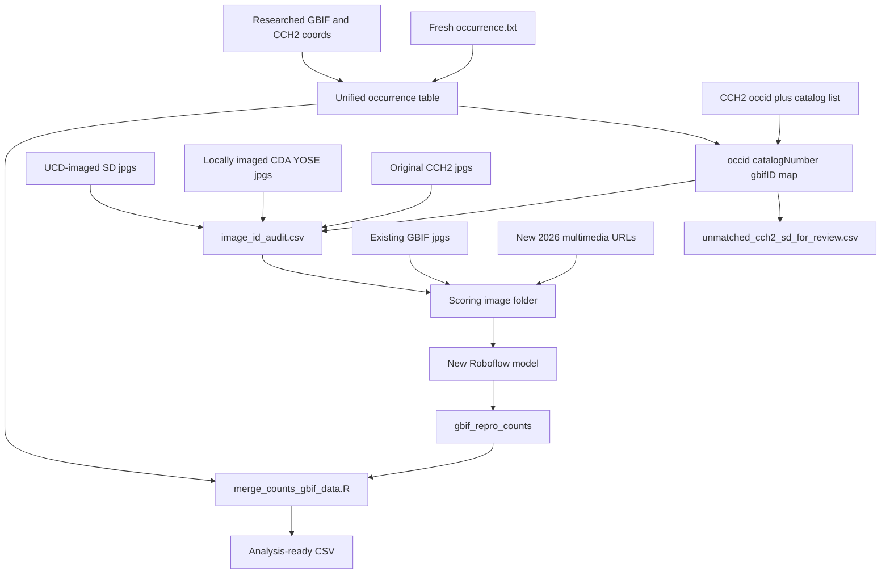

# Unify new GBIF download, CCH2 images, and new model

The old pipeline treated CCH2 California sheets and the GBIF US download as **separate** datasets: [RaphanusPhenology.qmd](RaphanusPhenology.qmd) **dropped** 1,327 GBIF rows whose `catalogNumber` was in [CCH2_2025_full_ID_list.txt](CCH2_2025_full_ID_list.txt). This update **keeps** those records so original CCH2-scored specimens and locally photographed SD sheets sit in the same GBIF-keyed table.

New Roboflow `MODEL_ID`: `raphanus-specimen-phenology/phenologyscoringeve-11-yolov8x-seg-t1`. Scoring scope: **all images**, not just new ones. Do not edit the old `phenologyscoringeve/10` strings in [image_handling_scripts/roboflow_to_json_parellelize.py](image_handling_scripts/roboflow_to_json_parellelize.py) or [RaphanusPhenology.qmd](RaphanusPhenology.qmd) unless asked.

**Do not change older files without asking.** Anything that already exists and was not created by this redo is read-only until you confirm. That includes scripts, CSVs, Quarto docs, [NOTES.md](NOTES.md), [GBIF_data_combining/](GBIF_data_combining/), `image_handling_scripts/`, image folders on `/Volumes/Radishes/`, and prior GBIF/CCH2 downloads. Prefer **copies** inside `GBIF_2026_update/` (new MODEL_ID, new paths) over in-place edits.

**Language and layout:** **new** pipeline code in **R** (`dplyr` / `readr`), all under [`GBIF_2026_update/`](GBIF_2026_update/). Do **not** rewrite existing Python in R. Reuse existing Python by **copying** into `GBIF_2026_update/` when paths or MODEL_ID must change: [image_handling_scripts/json_to_df.py](image_handling_scripts/json_to_df.py), [image_handling_scripts/roboflow_to_json_parellelize.py](image_handling_scripts/roboflow_to_json_parellelize.py), [image_handling_scripts/gbif_image_pull_from_multimedia.py](image_handling_scripts/gbif_image_pull_from_multimedia.py). Scripts read existing inputs from other folders by relative path from the project root.

New R scripts in `GBIF_2026_update/`:

- `build_image_id_audit.R` — crosswalk + audit sheet
- `build_unified_occurrence.R` — occurrence table + researched coords
- `assemble_scoring_images.R` — copy/rename scoring images
- `download_new_gbif_images.R` — diff new vs old GBIF IDs; write the download list (actual HTTP pull can use the existing Python puller)
- `merge_counts_gbif_data.R` — copy/adapt of the existing merge, pointed at this folder’s files

Existing Python (keep, do not convert):

- [image_handling_scripts/json_to_df.py](image_handling_scripts/json_to_df.py) — JSON predictions → `image`, `Bud Cluster`, `Flower`, `Fruit`
- [image_handling_scripts/roboflow_to_json_parellelize.py](image_handling_scripts/roboflow_to_json_parellelize.py) — inference
- [image_handling_scripts/gbif_image_pull_from_multimedia.py](image_handling_scripts/gbif_image_pull_from_multimedia.py) — download from a multimedia/URL list

Outputs land in `GBIF_2026_update/` (audit CSVs, occurrence tables, counts, needs-review sheets).

Inputs referenced from elsewhere (read-only):

- [GBIF_fresh_download_09.10.2026/occurrence.txt](GBIF_fresh_download_09.10.2026/occurrence.txt) and `multimedia.txt`
- [original_gbif_download/occurrence.txt](original_gbif_download/occurrence.txt) and `multimedia.txt`
- [CCH2_2025_full_ID_list.txt](CCH2_2025_full_ID_list.txt)
- [Output_Files/completed_specimen_data.csv](Output_Files/completed_specimen_data.csv)
- [Datasheet_mis-sort_fix_files/updated_csv_only_coordinates_for_adding_back.csv](Datasheet_mis-sort_fix_files/updated_csv_only_coordinates_for_adding_back.csv)
- `/Volumes/Radishes/Code/UCD_imaged_SDid_to_COREid.txt` and image folders on the drive

Coordinate overlay uses the same `match? == yes` rule as [Datasheet_mis-sort_fix_files/add_coordinates_to_fixed.py](Datasheet_mis-sort_fix_files/add_coordinates_to_fixed.py), implemented in the new R occurrence builder (that join is new pipeline code, not a rewrite of the old script). Do not edit `add_coordinates_to_fixed.py` or write into `Datasheet_mis-sort_fix_files/`.

## 0. Organize locally photographed sheets

You asked to move these off `tmp` / mixed folders onto:

- `/Volumes/Radishes/locally_imaged_herbarium_sheets/CDA_YOSE/`
- `/Volumes/Radishes/locally_imaged_herbarium_sheets/SD/`

On first execution (not before):

1. Create those two directories.
2. Move `CDA-*` and `YOSE*` image files from `/Volumes/Radishes/GBIF_phenology_scored_specimen_images/tmp` into `CDA_YOSE/` (keep catalog-number filenames). Leave JSON sidecars in `/Volumes/Radishes/jsons/` where they already are.
3. Put SD photos in `SD/`. Prefer original `SD000….jpg` names from [`UCD_imaged_SDid_to_COREid.txt`](/Volumes/Radishes/Code/UCD_imaged_SDid_to_COREid.txt). If those barcode files are not found and only occid-named copies exist (e.g. `2890234.jpg` in `OG_CCH2_phenology_scored_specimen_images/`), **copy** those mapped files into `SD/` and keep the CCH2 folder intact unless you later ask to remove duplicates.
4. Write a short `GBIF_2026_update/local_image_move_log.csv` (`from_path`, `to_path`, `filename`) so the move is reversible.

Pipeline `source_dir` for audit rows is these new folders, not `tmp`.

On first execution, list image directories on `/Volumes/Radishes/` (jpg globbing from the repo is unreliable because `*.jpg` is gitignored). Expected sources:

- Original CCH2 downloads (filenames = CCH2 `occid`, sometimes `SML_<occid>.jpg`), as in [Input_Files/annotated_inference_counts.csv](Input_Files/annotated_inference_counts.csv) and [CCH2_jsons_2025/](CCH2_jsons_2025/)
- Local UCD photos of previously unimaged SD sheets in `/Volumes/Radishes/locally_imaged_herbarium_sheets/SD/`, mapped in [`/Volumes/Radishes/Code/UCD_imaged_SDid_to_COREid.txt`](/Volumes/Radishes/Code/UCD_imaged_SDid_to_COREid.txt) (`SD00021403.jpg` → CCH2 occid `2890234.jpg`, ~104 sheets)
- Locally photographed **CDA and YOSE** sheets in `/Volumes/Radishes/locally_imaged_herbarium_sheets/CDA_YOSE/` (filenames are catalog numbers, e.g. `CDA-0047966.jpg`, `YOSE225087.jpg`). These were scored in the last GBIF run ([GBIF_data_combining/gbif_repro_counts](GBIF_data_combining/gbif_repro_counts) has 31 CDA + 4 YOSE). Treat as `image_source = locally_imaged_cda_yose`.
- Previously downloaded GBIF images (named by `gbifID`)
- Oversized copies under `/Volumes/Radishes/raw_big_images/` and `/Volumes/Radishes/GBIF_too_large/`

Write a crosswalk CSV (`occid`, `catalogNumber`, `gbifID`, `image_source`) by matching, in order:

1. GBIF `references` / occurrenceID CCH2 URLs (`...?occid=...`) to original CCH2 ids
2. `institutionCode` + `catalogNumber` vs [CCH2_2025_full_ID_list.txt](CCH2_2025_full_ID_list.txt) and [Output_Files/completed_specimen_data.csv](Output_Files/completed_specimen_data.csv)
3. SD barcode (`SD000…`) via the UCD mapping file

Report CCH2 occids and SD barcodes that **do not** appear in the new occurrence file to `GBIF_2026_update/unmatched_cch2_sd_for_review.csv`. **Do not** add those rows to the analysis occurrence table until they have been checked.

## 1b. Image ID audit sheet (manual double-check)

Write `GBIF_2026_update/image_id_audit.csv` — one row per scoring image — so you can confirm the specimen in the photo is the same record as the GBIF metadata. Keep the **original filename** even when the scoring copy is renamed to `gbifID.jpg`.

Columns:

- `gbifID` — ID from the 09.10.2026 download (blank if unmatched)
- `image_source` — one of `cch2_original`, `ucd_imaged_sd`, `locally_imaged_cda_yose`, `gbif_previous_download`, `gbif_fresh_download`
- `source_dir` — folder the file was copied from
- `original_filename` — name on disk in that source folder
- `scoring_filename` — name used for Roboflow (`gbifID.jpg`, `SML_<gbifID>.jpg`, or occid if unmatched)
- `cch2_occid`
- `catalogNumber` — herbarium accession / barcode
- `institutionCode`
- `otherCatalogNumbers` — from GBIF when present
- `locality`, `eventDate`, `scientificName` — enough to spot-check the sheet against the label
- `id_check_status` — `ok`, `needs_review`, or `unmatched`
- `id_check_notes` — why it was flagged

**Checks by image source** (fail closed: copy/rename only if the check passes; otherwise leave the row in the audit sheet as `needs_review`):

- **CCH2 originals:** filename (strip `SML_`) equals `cch2_occid`; that occid maps to exactly one new `gbifID`; GBIF `catalogNumber` agrees with the CCH2 catalog list when both exist.
- **UCD-imaged SD:** original filename matches `SD000….jpg` in `UCD_imaged_SDid_to_COREid.txt`; mapped occid is in the CCH2 set; GBIF `catalogNumber` is the same SD barcode or a known equivalent; do not assign a GBIF row whose accession is a different SD number.
- **Locally imaged CDA/YOSE:** filename (strip `SML_` and extension) is a catalog number matching `^(CDA-|YOSE)`; that `catalogNumber` maps to exactly one new `gbifID`; do not attach a file to a different accession. Unmatched catalog numbers go to the review sheet (same rule as unmatched CCH2/SD: do not append to the analysis table).
- **Previous GBIF jpgs:** filename (strip `SML_`) equals a `gbifID` that still exists in the new download. If that ID is absent (GBIF republished the record), try `occurrenceID` / catalog match and flag `gbifID_changed` rather than silently attaching the old file to a different specimen.
- **Fresh GBIF downloads:** multimedia `gbifID` equals the occurrence `gbifID` being filled; URL is not reused for a different ID.

Also write `GBIF_2026_update/image_id_audit_needs_review.csv` (subset where `id_check_status != ok`) for the first pass of manual checking.

**Multimedia caveat:** the new [GBIF_fresh_download_09.10.2026/multimedia.txt](GBIF_fresh_download_09.10.2026/multimedia.txt) is **column-shifted** vs its header. `type` is a dataset UUID, `format` is `StillImage`, `identifier` is empty, and the image URL is in `references`. Image-pull code must take the first `http(s)` URL from `identifier` **or** `references`, not `identifier` alone. Prefer `verbatim/multimedia.txt` (correct `datasetkey` + `identifier` columns) if it is populated.

## 2. Build the unified occurrence table with researched coordinates

Do **not** reuse the old CCH2-exclusion filter. New script: `GBIF_2026_update/build_unified_occurrence.R` (dplyr/readr; same filter style as [RScripts/GBIF_filter_dplyr.R](RScripts/GBIF_filter_dplyr.R)):

- Start from [GBIF_fresh_download_09.10.2026/occurrence.txt](GBIF_fresh_download_09.10.2026/occurrence.txt) (~5,895 rows).
- Apply the same geographic / quality filters as today (excluded states, `countryCode == US`, `PRESERVED_SPECIMEN`, non-empty locality), **without** dropping CCH2 catalog overlap.
- Fill coordinates from researched sources, matching **stable keys** because `gbifID` can change between downloads:
  1. `gbifID` if still present
  2. `occurrenceID`
  3. `institutionCode` + `catalogNumber`
  4. `(locality, verbatimLocality)` as last resort (same logic as [Datasheet_mis-sort_fix_files/add_coordinates_to_fixed.py](Datasheet_mis-sort_fix_files/add_coordinates_to_fixed.py), only rows whose `match?` first token is `yes` in [updated_csv_only_coordinates_for_adding_back.csv](Datasheet_mis-sort_fix_files/updated_csv_only_coordinates_for_adding_back.csv))
- Overlay CCH2 hand-assigned lat/long/uncertainty from [Output_Files/completed_specimen_data.csv](Output_Files/completed_specimen_data.csv) via the occid crosswalk, **only for rows that matched a GBIF occurrence**.
- **Prefer researched coordinates over GBIF-published ones** when a researched value exists (new download already has batch GeoLocate coords, e.g. SACT). Do not overwrite a researched value with empty or auto-georeferenced GBIF coords.
- **Do not append** original CCH2 / SD rows that fail to match a GBIF occurrence. Write them to `GBIF_2026_update/unmatched_cch2_sd_for_review.csv` with CCH2/SD metadata, attempted match keys (`occid`, `catalogNumber`, `institutionCode`, locality), and a `match_fail_reason` so you can see why they did not join. They stay out of `occurrence_unified.csv` until reviewed.
- Outputs in `GBIF_2026_update/`: `occurrence_unified.csv`, `occurrence_w_added_coords.csv`, `unmatched_cch2_sd_for_review.csv`.

## 3. Assemble the scoring image set

Working directory on the Radishes drive (gitignored `gbif_images/` pattern), named by **gbifID** where matched, otherwise CCH2 occid. Every copy/rename updates `image_id_audit.csv` (`source_dir`, `original_filename` → `scoring_filename`).

1. Copy original CCH2 jpgs only when the CCH2 ID check passes; rename occid → `gbifID` when matched.
2. Copy UCD-imaged SD jpgs from `/Volumes/Radishes/locally_imaged_herbarium_sheets/SD/` only when the SD barcode → occid → gbifID chain is consistent.
3. Copy locally imaged CDA/YOSE jpgs from `/Volumes/Radishes/locally_imaged_herbarium_sheets/CDA_YOSE/` only when the catalog-number ID check passes; scoring name can stay the catalog number or become `gbifID.jpg` with the original name kept in the audit sheet.
4. Copy already-downloaded GBIF jpgs only when the filename `gbifID` is still the same specimen in the new download (or a flagged `gbifID_changed` match has been reviewed).
5. **Download images for newly added GBIF specimens** from [GBIF_fresh_download_09.10.2026/multimedia.txt](GBIF_fresh_download_09.10.2026/multimedia.txt) (URL-column fix above). A specimen is “new” if it is in the unified occurrence table **and** was not in previous pull attempts:
   - not in [original_gbif_download/occurrence.txt](original_gbif_download/occurrence.txt) / [original_gbif_download/multimedia.txt](original_gbif_download/multimedia.txt)
   - not already on disk as a previous GBIF jpg (filename `gbifID`)
   - not already covered by a CCH2, UCD-imaged SD, or locally imaged CDA/YOSE file in the audit sheet
   Write `GBIF_2026_update/new_gbif_images_to_download.csv` (`gbifID`, URL, catalogNumber, institutionCode) before pulling. Download with a **copy** of [image_handling_scripts/gbif_image_pull_from_multimedia.py](image_handling_scripts/gbif_image_pull_from_multimedia.py) in `GBIF_2026_update/` (new list and scoring folder; skip existing files; write `GBIF_2026_update/failed_downloads.csv`). Do not overwrite the original puller. Tag these audit rows `image_source = gbif_fresh_download`.
6. Resize files over Roboflow’s 20MB limit with the existing `sips --resampleWidth 5000` convention (`SML_` prefix), then strip `SML_` only at merge time (already handled in [GBIF_data_combining/merge_counts_gbif_data.R](GBIF_data_combining/merge_counts_gbif_data.R)).

Do not re-download a sheet we already have locally (especially CAS 403s and SD sheets that were never on GBIF/CCH2 media). Previously failed URLs for **old** IDs can be retried later; this step is for records that were never in those earlier attempts.

## 4. Run the new model and merge counts

- Copy [image_handling_scripts/roboflow_to_json_parellelize.py](image_handling_scripts/roboflow_to_json_parellelize.py) into `GBIF_2026_update/` with `MODEL_ID = "raphanus-specimen-phenology/phenologyscoringeve-11-yolov8x-seg-t1"` and the scoring folder. Leave the original script unchanged unless you ask to update it.
- Convert JSONs with a copy of [image_handling_scripts/json_to_df.py](image_handling_scripts/json_to_df.py) writing `GBIF_2026_update/gbif_repro_counts`. Do not rewrite this in R; do not overwrite the original.
- Before merge, check that every `image` in the counts file appears in `image_id_audit.csv` and that `id_check_status == ok`. Flag count rows whose filename ID is not in the audit sheet. Unmatched CCH2/SD images stay on the review sheet and are **not** merged into the analysis table.
- Use `GBIF_2026_update/merge_counts_gbif_data.R` (adapted from [GBIF_data_combining/merge_counts_gbif_data.R](GBIF_data_combining/merge_counts_gbif_data.R)) on this folder’s occurrence and counts files. Extend catalog-style ID handling if any remaining images are still named by occid or `CDA-`/`YOSE`/`SD000…`.
- Carry forward `unscorable_image_ids` (and add any new obvious failures from the unmatched report).

## 5. Docs and what this pass will not do

- Write a short `GBIF_2026_update/README.md` covering layout, matching rules, CCH2 inclusion, multimedia URL quirk, local-image sources, and how to use `image_id_audit.csv` and `unmatched_cch2_sd_for_review.csv`.
- **Ask before** editing [NOTES.md](NOTES.md), [RaphanusPhenology.qmd](RaphanusPhenology.qmd), [ClimateNA_data_pull.qmd](ClimateNA_data_pull.qmd), or any other pre-existing file.
- Leave ClimateNA / figure regeneration as a **follow-on** after the merged table is checked.

## Implementation notes

- Keep bulk images on `/Volumes/Radishes/`; do not commit `*.jpg` or `gbif_images/`. Do not move or delete existing images without asking.
- Do not overwrite [GBIF_occurrence_fixed.csv](GBIF_occurrence_fixed.csv), files in [GBIF_data_combining/](GBIF_data_combining/), or originals in `image_handling_scripts/`.
- First runnable check after the crosswalk: counts of (a) original CCH2 ids in the new GBIF list, (b) CCH2/SD ids written to `unmatched_cch2_sd_for_review.csv`, (c) SD local images matched, (d) rows that received researched coords, (e) audit rows with `needs_review`, (f) newly added GBIF specimens queued for multimedia download.
